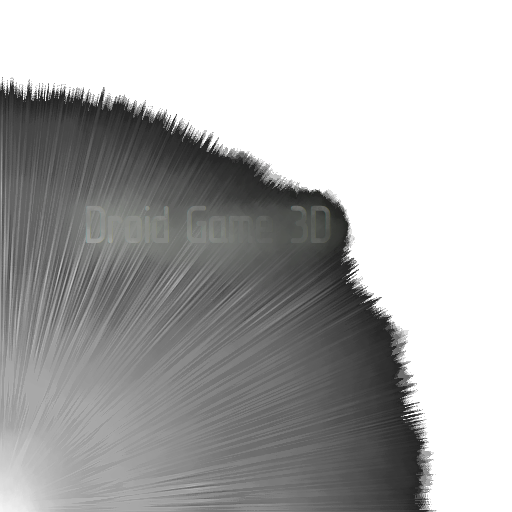

<div id="droidgame3d-logo" align="center">
    <br/>
    
    <h2>Python Panda3D Third Person Shooter.</h2>
</div>

<div id="badges" align="center">

[](https://gitter.im/WennMarcoRTX/MarcoEngine?utm_source=badge&utm_medium=badge&utm_campaign=pr-badge&utm_content=body_badge) 

</div>

This is a fresh game that was developed using the **Panda3D** game engine and **Python** language in the **PyCharm** IDE (I don't know why you need this information).
At the moment, the game has a fairly large audience and a large daily online (1000+ players are stable). In general, there seems to be nothing more remarkable here, it's time to start our journey..

# ⌨️ Installation
## 🖥️ Linux
In the **Linux** operating system, everything is simple: first, install all the packages `pip install -r requirements.txt`, write to the terminal `git clone https://github.com/WennMarcoRTX/droidgame3d.git`, then `cd droidgame3d`, we write if you have Cython, then `cython ./game.pyx`, and if just Python, then ` python3 ./game.py`, if you have C, then `c ./game.c` (an assembly for Go, Ruby and C ++ will be released soon, wait;) ).
## 👨‍💻 Windows
For **Windows** we have a separate assembly with *.exe* and *.dll* files, which are always included when a new version is released, but if you want to play the game with the source code, then the installation is the same as y **Linux**, congratulations. 

# 🇨 Build to C
To compile to a .C file, you must enter the command from the game directory:
```
python setup.py build_ext --inplace
```

Type __y__ or just press __Enter__. After that, compilation will start. Although, you are unlikely to need it, because the repository already has a *.C* file with the game.

# 🅱️ Build to *.exe* / *.bin*
To build *exe* or *bin* using **Nuitka** write in terminal:
```
bash build.sh
```
Done! Enjoy to play! 😉

# ⌨️ Management
Here is the complete control for our game.
## 🔵 On the menu:
In any menu of our game, wherever you are, from choosing a server to a chat, everywhere the **Esc** button closes this menu. If you are in the main menu - **Esc** closes it and the game ends.
## 🔴 In Game:
*Note: jumps like **forward + left** are possible.*

| ***Command*** | Esc | Left arrow | Right arrow | Forward Arrow | A | D | Space | S | W | P | G | F | 0 | F3 | R |
| :---: | :---: | :---: | :---: | :---: | :---: | :---: | :---: | :---: | :---: | :---: | :---: | :---: | :---: | :---: | :---: |
| ***About*** | Exit | Turn the droid to the left. | Turn the droid to the right. | Moves the droid forward. | Shift of the camera focus relative to the droid to the left. | Shift the focus of the camera relative to the droid to the right. | Shot. | Get the flashlight (if you already got it, the **S** button will turn it on and off). | Remove weapon. | Show the sight (if it is already shown - remove it). | Throw a grenade. | Start moving the ship. | In case of fire. Extinguishes the fire. | Only if single player, turns on polygon mode. | Turns RPG mode on and off. |


# ⚙️ Optimization
Our game has already been rewritten in **C** and **Cython**. We are now rewriting it to **Go** and **Ruby**.
However, for all versions we use additional optimization:


- [x] AsyncIO.
- [ ] Support for CUDA (work of all code on the GPU).

